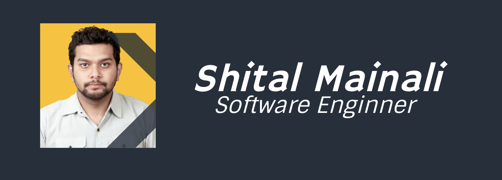

 
 <em align="center">I am currently udpating my Personal Github Profile(Since April 2024) So if it is empty, pelase come back later.</em>
 

<h1 align="center" size="50px">
Hello There! I am Shital Mainali a software engineer. 
</h1>

🔭  I’m currently working at [Giftpad Co. Ltd](https://github.com/giftpad) as Software Engineer.

🌱 I’m currently learning  Test Driven Development.

📫 Email me at: hey@shitalmainali.com.np

⚡ Fun fact: I never get bored of programming
 
 

 

# 💻Tech Stack

 
 
 
 
 
 
 

 

 
 

 

 <a href="https://github.com/spiderb59/">
  
    

 

 

## 🌐Connect with me

  
<em> Profile Layout Inspired From: [Krishna Pd Achraya](https://github.com/krishnabot)</em>

